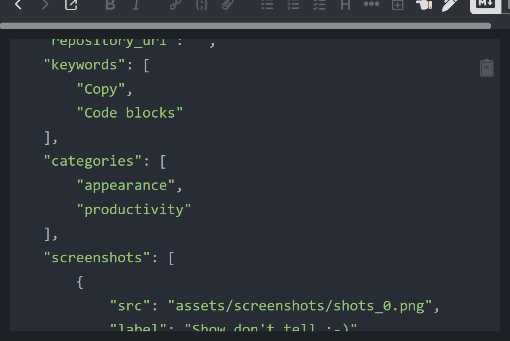

# SIS•SOFT - Joplin plugin code copy
A lightweight **Joplin plugin** that adds a convenient **“Copy” button** to every Markdown code , allowing users to copy code snippets extracts to their clipboard
— without selecting anything manually.

## Features
- Adds a small, **copy icon** to each fenced code in the Joplin editor and viewer.  
- **One-click copy** of the entire code to the clipboard.  

## Preview

## Building
The plugin is built using Webpack, which creates the compiled code in `/dist`. A JPL archive will also be created at the root, which can use to distribute the plugin.
- To build the plugin, run `npm run dist`.

## Source
**Icon By :** [Shannon E. Thomas](https://www.svgrepo.com/svg/411851/copy) 

## Inspirations
**Dragonish :** [Copy Code Blocks](https://github.com/LightAPIs/joplin-copy-code-blocks) 

## License
[MIT](./LICENSE) license